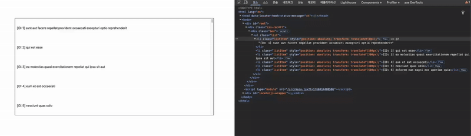
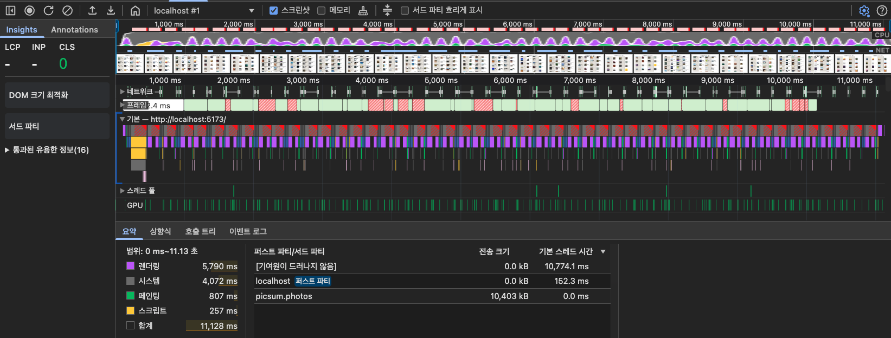
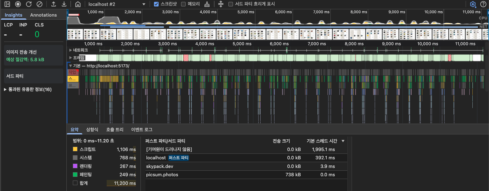
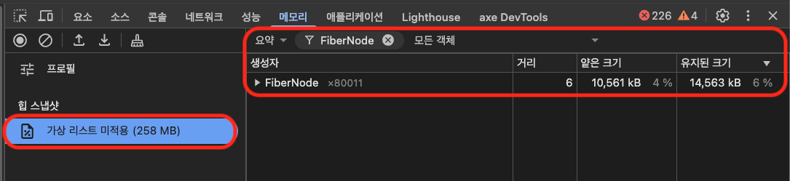
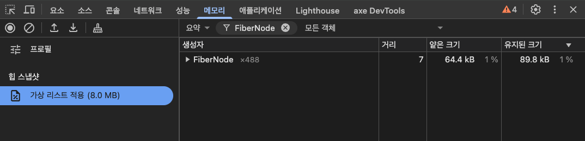
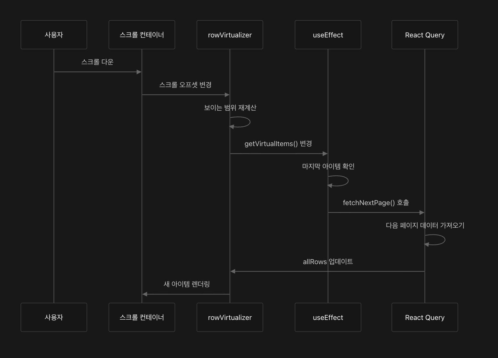
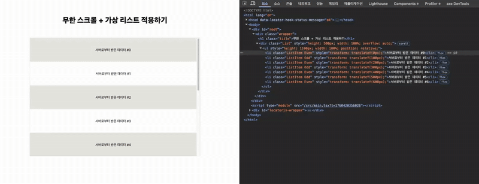

# 가상 리스트(**Virtualized List**)

> [!NOTE]  
> 이 글은 가상 리스트(Virtualized List)란 무엇인지, 왜 필요한지에 대해 설명하는 글입니다.

<br/>

## 가상 리스트란?

가상 리스트(Virtualized List)는 화면에 보이지 않는 리스트 아이템의 DOM 생성을 생략하고, 실제로 보이는 영역만 렌더링하는 기술입니다.

예를 들어 10,000개의 데이터를 받아왔더라도, 화면에는 20개 정도의 DOM만 생성하여 성능을 크게 개선할 수 있습니다.


<br/>

## 배경 및 등장 이유

대량의 데이터를 한 번에 렌더링하면 브라우저 성능이 크게 떨어집니다. 사용자는 실제로 화면에 보이는 일부 데이터만 필요로 하므로, 나머지 데이터의 DOM 생성은 불필요한 리소스 낭비입니다.

이런 문제를 해결하기 위해 가상 리스트가 등장했습니다.

<br/>

## 프론트엔드에서 가상 리스트가 필요한 경우

- 1,000개 이상의 리스트를 렌더링해야 하는 경우
- 테이블, 채팅, 피드 등 스크롤이 많은 UI
- 모바일 환경이나 저사양 기기에서 성능 최적화가 필요한 경우
- 리스트 아이템의 동적 높이, 무한 스크롤 등이 필요한 경우

<br/>

## 가상 리스트 구현 개념

가상 리스트의 기본 원리는 "**보이는 영역의 인덱스만 계산해서 해당 데이터만 렌더링**"하는 것입니다.

조금 더 구체적으로 설명하면 **스크롤 위치에 따라 화면에 보여야 할 아이템만 렌더링하고, 각 아이템을 실제 위치에 맞게 배치**하는 것입니다.

아래는 가상 리스트를 라이브러리 없이 간단하게 구현한 예시 코드입니다.

### 인터페이스 설계

```tsx
function VirtualizedList({ items, visibleCount, itemHeight, overscan });
```

| Prop           | 설명                                                   |
| -------------- | ------------------------------------------------------ |
| `items`        | 전체 아이템 배열                                       |
| `visibleCount` | 한 번에 보이는 아이템 개수                             |
| `itemHeight`   | 각 아이템의 높이                                       |
| `overscan`     | 화면에 보이는 영역 위/아래로 추가 렌더링할 아이템 개수 |

<br/>

### 내부 동작

1. 스크롤 상태 추적:

```tsx
const [scrollTop, setScrollTop] = useState(0);
```

- 스크롤이 움직일 때마다 `scrollTop`을 갱신해요.

<br/>

2. 렌더링 범위 계산:

```tsx
const rawStartIndex = Math.floor(scrollTop / itemHeight);
const startIndex = Math.max(0, rawStartIndex - overscan);

const rawEndIndex = rawStartIndex + visibleCount + overscan;
const endIndex = Math.min(rawEndIndex, totalCount);
```

- `startIndex`: 현재 스크롤 위치에서 맨 위에 보여야 할 아이템의 index
- `endIndex` : 보이는 마지막 아이템의 index

> [!IMPORTANT]  
> `overscan`이 필요한 이유
>
> 스크롤을 내릴 때 아이템을 렌더링하면 깜박임 현상이 발생해 스크롤 경험이 저하될 수 있습니다. 이를 방지하기 위해 화면에 보이는 아이템 범위 외에도 일정 개수의 아이템을 미리 렌더링하는 `overscan` 기능을 사용합니다.
>
> 이 기능을 활용하면 스크롤 시 새 아이템이 즉시 화면에 표시되어 깜박임이 줄어들고 부드러운 스크롤이 가능합니다.
>
> 다만, `overscan` 값을 너무 크게 설정하면 불필요한 아이템까지 렌더링되어 메모리와 성능에 부담이 될 수 있으므로 적절히 조절하는 것이 중요합니다.


<br/>

3. 보이는 아이템만 추출:

```tsx
const visibleItems = items.slice(startIndex, endIndex);
```

- 실제로 렌더링할 아이템만 잘라서 준비해요.

<br/>

4. 스크롤 컨테이너와 전체 높이:

```tsx
<div style={{ height: visibleCount * itemHeight, overflowY: "auto" }}>
  <ul style={{ height: totalCount * itemHeight, position: "relative" }}>
```

- 바깥 `<div>` 는 고정 높이로 스크롤 가능하게 만들고,
- `<ul>` 은 전체 리스트 높이만큼 공간을 차지해요.

<br/>

5. 아이템을 실제 위치에 배치:

```tsx
<li
  style={{
    position: "absolute",
    transform: `translateY(${(startIndex + i) * itemHeight}px)`,
    height: itemHeight,
  }}
/>
```

- 각 아이템을 `absolute` 로 배치해서, 실제 리스트 위치에 맞게 보여줘요
- `translateY` 값이 `(startIndex + i) * itemHeight`라서, 스크롤해도 아이템이 자연스럽게 제자리에 있는 것처럼 보여요.

<br/>

### 💡 시각적으로 요약하기

```tsx
visibleCount = 5, overscan = 1 기준

(위에는 렌더링 안됨)
| [ID: 45] ...            |
|-------------------------| ← visibleCount * itemHeight 만큼만 보임
| [ID: 46] ...            | ← startIndex
| [ID: 47] ...            |
| [ID: 48] ...            |
| [ID: 49] ...            |
| [ID: 50] ...            | ← endIndex
|-------------------------|
| [ID: 51] ...            |
(밑에는 렌더링 안됨)
```

<br/>

### 🎥 실제 컴포넌트 동작 영상



- 7개의 아이템(`<li>`)만 렌더링되는 것을 볼 수 있습니다.

<br/>

### 💬 전체 예시 코드

```tsx
function VirtualizedList({
  items, // 아이템 배열
  visibleCount, // 화면에 보이는 아이템 개수
  itemHeight, // 각 아이템의 높이
}) {
  const [scrollTop, setScrollTop] = useState(0);

  const totalCount = items.length;
  const startIndex = Math.floor(scrollTop / itemHeight);
  const endIndex = Math.min(startIndex + visibleCount, totalCount);

  const visibleItems = items.slice(startIndex, endIndex);

  return (
    <div
      style={{
        height: visibleCount * itemHeight,
        overflowY: "auto",
        border: "1px solid #000",
      }}
      onScroll={(e) => setScrollTop(e.currentTarget.scrollTop)}
    >
      <ul style={{ height: totalCount * itemHeight, position: "relative" }}>
        {visibleItems.map(({ id, title }, i) => (
          <li
            key={id}
            style={{
              position: "absolute",
              transform: `translateY(${(startIndex + i) * itemHeight}px)`,
              height: itemHeight,
              width: "100%",
              borderBottom: "1px solid #ccc",
              display: "flex",
              alignItems: "center",
              padding: "0 10px",
            }}
          >
            {`[ID: ${id}] ${title}`}
          </li>
        ))}
      </ul>
    </div>
  );
}

export default VirtualizedList;
```

위 구현은 가상 리스트를 간단하게 구현한 것으로 `아이템의 동적 크기 변화` , `무한 스크롤` , `Table` , `Masonry Layout` 등 다양한 기능을 지원하려면 별도의 코드를 작성해야 합니다.

이러한 부가 기능들을 지원하는 라이브러리들을 아래에서 소개하도록 하겠습니다.

<br/>

## 💥 가상 리스트 라이브러리 비교

### [react-virtualized](https://github.com/bvaughn/react-virtualized)

장점: 다양한 컴포넌트(리스트, 그리드, 셀 등)와 고급 기능(고정 및 동적 높이, 셀 측정, 스크롤 동기화 등)을 갖추고 있어 대규모 복잡한 프로젝트에 적합

단점: 번들 크기가 크고 API가 다소 복잡하며 설정 난이도가 높은 편

지원 기능: 고정 및 동적 높이, 그리드, 셀 크기 자동 측정, 스크롤 동기화, 무한 스크롤 등 폭넓은 기능을 지원

커스텀 유연성: 다양한 옵션 제공으로 커스터마이징 가능하지만 복잡도가 높아 다소 어려운 편

<br/>

### [react-window](https://github.com/bvaughn/react-window)

장점: 번들 크기가 작고 빠른 속도, 간단한 API로 사용하기 쉬우며 성능 최적화에 매우 효과적

단점: 동적 높이 지원이 제한적이며, 복잡한 UI 기능(셀 병합, 동적 그룹핑 등)은 부족

지원 기능: 고정 높이 및 제한적인 가변 높이 리스트, 그리드 지원, 기본적인 가상화 기능 제공

커스텀 유연성: 간단한 사용법과 기본적인 커스터마이징 가능하나 유연성은 제한적

<br/>

### [react-virtuoso](https://github.com/petyosi/react-virtuoso)

장점: 동적 높이, 무한 스크롤, 그룹핑, 변형 리스트 등 다양한 고급 기능을 제공하며 API가 비교적 쉬운 편

단점: 번들 크기가 커서 용량에 민감한 프로젝트에서는 고려가 필요하고, 학습 곡선이 존재

지원 기능: 동적 높이 자동 감지, 무한 스크롤, 리스트 그룹핑, 다양한 변형 리스트 등을 지원

커스텀 유연성: 사용자 정의 옵션이 다양하여 상세한 커스터마이징과 확장성이 뛰어남

<br/>

### [@tanstack/react-virtual](https://github.com/TanStack/virtual)

장점: React 훅 기반으로 유연성이 매우 높고 TanStack 생태계(예: TanStack Table 등)와 높은 호환성을 제공

단점: 직접 렌더링 코드를 작성해야 하며, 비교적 문서가 부족해 초기 학습에 시간이 걸릴 수 있음

지원 기능: 고정 및 가변 높이, 스크롤 위치 추적, 기본적인 가상 리스트 기능 지원

커스텀 유연성: 훅을 직접 사용해 필요에 맞는 커스터마이징이 매우 자유롭게 가능

<br/>

### 정리하기

| 라이브러리명            | 장점                                                        | 단점                                                      | 지원 기능                                                                   | 커스텀 유연성               |
| ----------------------- | ----------------------------------------------------------- | --------------------------------------------------------- | --------------------------------------------------------------------------- | --------------------------- |
| react-virtualized       | 다양한 컴포넌트, 복잡한 기능 제공                           | 번들 크기가 크고 API가 복잡                               | 고정 및 동적 높이, 그리드, 셀 크기 자동 측정, 스크롤 동기화, 무한 스크롤 등 | 유연하지만 복잡도가 높은 편 |
| react-window            | 번들 크기가 작고 빠른 속도, 간단한 API로 성능 최적화에 적합 | 동적 높이 지원이 제한적, 복잡한 기능 제공 X               | 고정 높이 및 제한적인 가변 높이 리스트, 그리드 지원, 기본적인 가상화        | 유연하지 않음               |
| react-virtuoso          | 다양한 고급 기능 제공, API가 쉬운 편                        | 번들 크기가 큼, API가 쉽지만 기능이 많아 학습 곡선이 존재 | 동적 높이 자동 감지, 무한 스크롤, 리스트 그룹핑, 다양한 변형 리스트 등      | 유연함                      |
| @tanstack/react-virtual | 유연성이 매우 높고 TanStack 생태계와 높은 호환성            | 직접 렌더링 코드를 작성해야 하며, 비교적 문서가 적은 편   |                                                                             | 유연함                      |

아래와 같은 기준들로 라이브러리를 사용할 수 있습니다.

- 번들 크기가 작고 간단한 기능만 필요한 경우: `react-window`
- 다양한 기능을 사용하는 경우: `react-virtuoso` (`react-virtualized` 도 다양한 기능을 제공하나 최신 유지보수가 안되는 편)
- 커스텀에 유연해야 하는 경우: `@tanstack/react-virtual`

<br/>

## 가상 리스트 적용 전/후 성능 비교

### 테스트 환경

- 기기: Apple M1 Pro 16GB
- 모니터: 1920 x 1080 / 120hz
- 브라우저: 크롬, CPU 4x 감속, 네트워크 지연 X
- 행동: 10초 동안 스크롤
- 화면에 보이는 아이템의 개수: 16개(4열 그리드)

### 렌더링 성능

|              가상 리스트 적용 전              |              가상 리스트 적용 후              |
| :-------------------------------------------: | :-------------------------------------------: |
|  |  |

| 지표                     | 적용 전     | 적용 후   | 개선율          |
| ------------------------ | ----------- | --------- | --------------- |
| 총 렌더링 시간           | 5,790ms     | 267ms     | **약 95% 개선** |
| 스크립트 실행 시간       | 257ms       | 1,106ms   | -               |
| 페인팅 시간              | 807ms       | 249ms     | **약 69% 개선** |
| 시스템 시간              | 4,072ms     | 768ms     | **약 81% 개선** |
| 프레임 드랍(빨간색) 발생 | 많음 (15회) | 적음(4회) | **안정화**      |

### 메모리 사용량

|           가상 리스트 적용 전            |           가상 리스트 적용 후            |
| :--------------------------------------: | :--------------------------------------: |
|  |  |

| 지표             | 적용 전   | 적용 후 | 개선율          |
| ---------------- | --------- | ------- | --------------- |
| JS Heap Size     | 258 MB    | 8.0 MB  | **약 96% 감소** |
| FiberNode 개수   | 8,001개   | 488개   | **약 93% 감소** |
| FiberNode 메모리 | 10,561 KB | 64.4 KB | **약 99% 감소** |

> [!IMPORTANT]
> 전체적으로 성능이 개선되었지만 가상 리스트를 적용하는 추가적인 스크립트로 인해 스크립트 실행 시간이 증가하고, 스크롤 위치를 계산하는 로직, 아이템 동적 교체 등으로 인해 리렌더링 횟수가 증가한 것을 볼 수 있다.

<br/>

## 무한 스크롤 + 가상 리스트 적용하기(with `@tanstack/react-virtual`)

아래 코드는 서버 상태 관리 라이브러리로 많이 사용되는 `@tanstack/react-query` 와 `@tanstack/react-virtual` 를 사용하여 무한 스크롤 + 가상 리스트를 적용하는 예시 코드입니다.

<br/>

### 데이터 패칭 및 가상 리스트 설정

1. 데이터 패칭(`@tanstack/react-query`)

```tsx
const { data, isFetchingNextPage, fetchNextPage, hasNextPage } =
  useInfiniteQuery({
    queryKey: ["projects"],
    queryFn: (ctx) => fetchServerPage(10, ctx.pageParam),
    getNextPageParam: (lastGroup) => lastGroup.nextOffset,
    initialPageParam: 0,
  });
```

- `useInfiniteQuery` : 페이지 단위로 데이터를 가져오는 React Query 훅
- `data.pages` : 각 페이지의 데이터를 배열로 저장
- `fetchNextPage` : 다음 페이지 데이터를 가져오는 함수
- `hasNextPage` : 더 가져올 데이터가 있는지 여부

<br/>

2. 데이터 평탄화

```tsx
const allRows = data ? data.pages.flatMap((d) => d.rows) : [];
```

- 페이지별로 나뉜 데이터를 하나의 배열로 합칩니다. ex) `[[1,2,3], [4,5,6]]` → `[1,2,3,4,5,6]`

<br/>

3. 가상 리스트 설정(`@tanstack/react-virtual`)

```tsx
const rowVirtualizer = useVirtualizer({
  count: hasNextPage ? allRows.length + 1 : allRows.length,
  getScrollElement: () => parentRef.current,
  estimateSize: () => 100,
  overscan: 5,
});
```

- `count`: 더 가져올 데이터가 있으면 로딩 행을 위해 +1 (로딩 인디케이터, 스켈레톤 등을 렌더링하기 위함)
- `getScrollElement` : 스크롤 컨테이너 참조 반환
- `estimateSize` : 각 아이템의 예상 높이
- `overscan` : 화면 밖의 아이템을 추가로 렌더링하여 스크롤 시 렌더링 깜박임 방지

> [!TIP]
> 아이템을 동적으로 측정하는 경우, 부드러운 스크롤을 위해 `estimateSize`에서 아이템의 최대 예상 크기를 설정하는 것을 권장합니다.

<br/>

4. 무한 스크롤 트리거

```tsx
useEffect(() => {
  const [lastItem] = [...rowVirtualizer.getVirtualItems()].reverse();

  if (!lastItem) {
    return;
  }

  if (
    lastItem.index >= allRows.length - 1 &&
    hasNextPage &&
    !isFetchingNextPage
  ) {
    fetchNextPage();
  }
}, [
  hasNextPage,
  fetchNextPage,
  allRows.length,
  isFetchingNextPage,
  rowVirtualizer.getVirtualItems(),
]);
```

- `getVirtualItems()` : 현재 화면에 보이는 가상 아이템 배열 반환
- `lastItem.index >= allRows.length - 1` : 마지막 아이템이 데이터 끝에 도달했는지 확인
- `hasNextPage && !isFetchingNextPage` : 추가로 더 로드할 데이터가 있는지 확인
- 위 조건 충족 시 `fetchNextPage()` 함수 호출

<br/>

### DOM 구조

<br/>

1. 스크롤 컨테이너

```tsx
<div ref={parentRef} style={{ height: `500px`, overflow: 'auto' }}>
```

- `parentRef` 로 스크롤 컨테이너 참조
- 고정 높이와 `overflow: auto`로 스크롤 가능하게 설정

<br/>

2. 전체 크기 컨테이너

```tsx
<ul style={{ height: `${rowVirtualizer.getTotalSize()}px`, position: 'relative' }}>
```

- `getTotalSize()`: 모든 아이템의 총 높이를 계산하여 스크롤바 크기 결정

<br/>

3. 가상 아이템 렌더링

```tsx
{
  rowVirtualizer.getVirtualItems().map((virtualRow) => {
    const isLoaderRow = virtualRow.index > allRows.length - 1;
    const post = allRows[virtualRow.index];

    return (
      <li
        key={virtualRow.index}
        style={{
          position: "absolute",
          top: 0,
          left: 0,
          width: "100%",
          height: `${virtualRow.size}px`,
          transform: `translateY(${virtualRow.start}px)`,
        }}
      >
        {isLoaderRow ? "Loading more..." : post}
      </li>
    );
  });
}
```

- `transform: translateY(${virtualRow.start}px)`: 각 아이템을 정확한 위치로 이동
- `virtualRow.start`: 아이템의 시작 위치 (픽셀)
- `isLoaderRow`: 인덱스가 데이터 범위를 벗어나면 로딩 표시

<br/>

### 📈 실행 흐름



<br/>

### 🎥 실제 컴포넌트 동작 영상



<br/>

### 💬 전체 예시 코드

```tsx
const fetchServerPage = async (
  limit: number,
  offset: number = 0
): Promise<{ rows: string[]; nextOffset: number }> => {
  const rows = Array.from(
    { length: limit },
    (_, i) => `서버로부터 받은 데이터 #${i + offset * limit}`
  );

  await new Promise((resolve) => setTimeout(resolve, 500));
  return { rows, nextOffset: offset + 1 };
};

function App() {
  const { data, isFetchingNextPage, fetchNextPage, hasNextPage } =
    useInfiniteQuery({
      queryKey: ["projects"],
      queryFn: (ctx) => fetchServerPage(10, ctx.pageParam),
      getNextPageParam: (lastGroup) => lastGroup.nextOffset,
      initialPageParam: 0,
    });

  const allRows = data ? data.pages.flatMap((d) => d.rows) : [];

  const parentRef = useRef<HTMLDivElement>(null);

  const rowVirtualizer = useVirtualizer({
    count: hasNextPage ? allRows.length + 1 : allRows.length,
    getScrollElement: () => parentRef.current,
    estimateSize: () => 100,
    overscan: 2,
  });

  useEffect(() => {
    const [lastItem] = [...rowVirtualizer.getVirtualItems()].reverse();

    if (!lastItem) {
      return;
    }

    if (
      lastItem.index >= allRows.length - 1 &&
      hasNextPage &&
      !isFetchingNextPage
    ) {
      fetchNextPage();
    }
  }, [
    hasNextPage,
    fetchNextPage,
    allRows.length,
    isFetchingNextPage,
    rowVirtualizer.getVirtualItems(),
  ]);

  return (
    <div>
      <h1>무한 스크롤 + 가상 리스트 적용하기</h1>
      <div
        ref={parentRef}
        style={{
          height: `500px`,
          width: `100%`,
          overflow: "auto",
        }}
      >
        <ul
          style={{
            height: `${rowVirtualizer.getTotalSize()}px`,
            width: "100%",
            position: "relative",
          }}
        >
          {rowVirtualizer.getVirtualItems().map((virtualRow) => {
            const isLoaderRow = virtualRow.index > allRows.length - 1;
            const post = allRows[virtualRow.index];

            return (
              <li
                key={virtualRow.index}
                className={
                  virtualRow.index % 2 ? "ListItem Odd" : "ListItem Even"
                }
                style={{
                  position: "absolute",
                  top: 0,
                  left: 0,
                  width: "100%",
                  height: `${virtualRow.size}px`,
                  transform: `translateY(${virtualRow.start}px)`,
                }}
              >
                {isLoaderRow ? "Loading more..." : post}
              </li>
            );
          })}
        </ul>
      </div>
    </div>
  );
}
```

<br/>

## **가상 리스트 적용은 항상 좋을까?**

가상 리스트의 장점만 들으면 적용하는 것이 항상 좋을 것이라는 생각이 들 수 있지만 렌더링 할 DOM 개수가 적은 경우에 가상 리스트를 사용하면 오히려 성능이 나빠질 수 있습니다.

<br/>

### 주요 오버헤드

- 스크롤 추적: 매 스크롤마다 이벤트 리스너가 실행되고 오프셋을 계산합니다.
- 레이아웃 계산: 전체 아이템의 위치를 미리 계산하고 캐시에 저장해야 합니다.
- ResizeObserver: 동적 크기 측정 시 각 아이템에 `ResizeObserver`를 연결하고, `requestAnimationFrame`을 사용하면 추가 지연이 발생합니다

<br/>

> [!TIP]
> 이처럼 가상 리스트 적용은 항상 성능을 최적화해주는 것이 아닌 트레이드 오프가 생기는 작업이기 때문에 렌더링 해야 하는 DOM 개수가 많거나 실제로 버벅임 등의 성능 이슈가 생기는 경우에만 적용하는걸 권장드립니다.

<br/>

## 정리하기

가상 리스트(Virtualized List)는 대량 데이터 렌더링 시 성능 저하 문제를 해결하기 위해 화면에 실제로 보이는 아이템만 렌더링하는 기술입니다.

이를 통해 불필요한 DOM 생성과 렌더링 비용을 줄여 부드러운 사용자 경험을 제공합니다.

<br/>

가상 리스트는 특히 1,000개 이상의 리스트, 테이블이나 채팅 같은 스크롤이 많은 UI, 모바일과 저사양 환경에서 필수적입니다. 동적 높이와 무한 스크롤 같은 복잡한 기능을 효과적으로 지원하며, 라이브러리를 활용하면 구현 효율성과 유지보수성을 높일 수 있습니다.

> [!TIP]
> 모바일 환경에서는 안드로이드와 iOS 네이티브 리스트 컴포넌트가 내부적으로 가상화 기능을 적용해 대용량 리스트와 복잡한 스크롤 UI에서도 기본적인 성능 최적화를 지원합니다.

<br/>

주요 라이브러리마다 특징과 장단점이 있으니 프로젝트 요구에 맞게 선택하는 것이 중요합니다. 예를 들어, 단순하고 가벼운 사용에는 `react-window`, 다양한 기능과 쉬운 API는 `react-virtuoso`, 높은 유연성과 커스텀을 원한다면 `@tanstack/react-virtual`이 적합합니다.

<br/>

하지만 가상 리스트는 항상 성능을 개선하지는 않으며, 렌더링해야 할 DOM이 적은 경우 오히려 오버헤드로 작용할 수 있습니다. 따라서 실제 성능 이슈가 있는 경우에만 적용하는 것이 권장됩니다.

<br/>

> [!IMPORTANT]  
> 가상 리스트는 프론트엔드 대규모 데이터 UI 성능 최적화의 핵심 기술로, 제대로 이해하고 적절히 활용하는 것이 중요합니다.

<br/>

## 참고 자료

- [긴 목록 가상화하세요](https://ko.legacy.reactjs.org/docs/optimizing-performance.html#virtualize-long-lists)
- [윈도잉(windowing) 기법을 적용한 고성능 표 컴포넌트 개발기](https://d2.naver.com/helloworld/1450243)
- [windowing 기법](https://victor-log.vercel.app/post/windowing/)
- [[React] Windowing으로 렌더링 성능 최적화하기](https://hphhbva.tistory.com/94)
- [오늘의집 내 무한 스크롤 개발기](https://www.bucketplace.com/post/2020-09-10-%EC%98%A4%EB%8A%98%EC%9D%98%EC%A7%91-%EB%82%B4-%EB%AC%B4%ED%95%9C%EC%8A%A4%ED%81%AC%EB%A1%A4-%EA%B0%9C%EB%B0%9C%EA%B8%B0/)
- [Building a virtualized list from scratch](https://medium.com/ingeniouslysimple/building-a-virtualized-list-from-scratch-9225e8bec120)
- [react-window](https://github.com/bvaughn/react-window)
- [react-virtualized](https://github.com/bvaughn/react-virtualized)
- [react-virtuoso](https://github.com/petyosi/react-virtuoso)
- [@tanstack/react-virtual](https://github.com/TanStack/virtual)
- [반응 창을 사용하여 대규모 목록 가상화](https://web.dev/articles/virtualize-long-lists-react-window?hl=ko)
